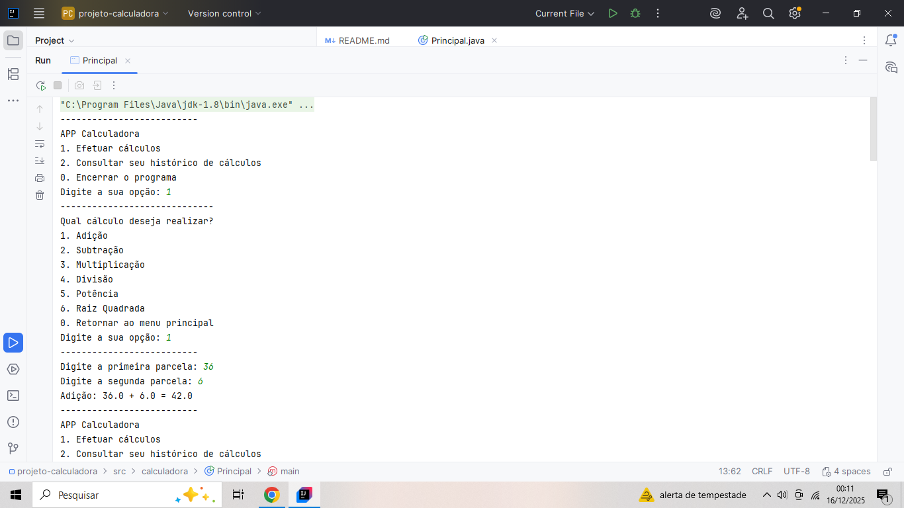

# Calculadora Aritmética
___________________________________

## Introdução
___________________________________
A calculadora efetua seis operações matemáticas: adição, subtração, multiplicação, divisão, potência e raiz quadrada.

Além de poder realizar operações aritméticas, é possível consultar o histórico com todas as operações efetuadas durante a execução do programa.

## Objetivo do Projeto

------------------------------------
Projeto desenvolvido com foco em lógica de programação e aplicação prática dos conceitos de Programação Orientada a Objetos em Java.

## Tecnologia(s) Utilizada(s)

------------------------------------
◾ Java (JDK 8+)

◾ Intellij IDEA

## Decisões de Design

------------------------------------
Cada operação aritmética foi implementada em uma classe específica (Adição, Subtração, Multiplicação, Divisão, Potência e Raiz Quadrada), todas herdando de uma classe abstrata.

Essa decisão teve caráter didático, com o objetivo de reforçar conceitos de Programação Orientada a Objetos como abstração, encapsulamento e polimorfismo, além de facilitar a extensibilidade do código para futuras operações.

Embora em um cenário de produção uma implementação mais enxuta (por exemplo, utilizando estruturas condicionais ou funções simples) pudesse ser mais adequada, a separação em classes permitiu exercitar o design orientado a objetos de forma mais clara e estruturada.

## Conceitos Aplicados

------------------------------------
◾ Lógica de Programação; 

◾ Classes e Objetos;

◾ Abstração para modelar a calculadora;

◾ Encapsulamento para proteger o histórico de cálculos e controlar o acesso ao estado interno das classes;

◾ Polimorfismo e Herança (estrutura preparada para extensão);

◾ Separação de responsabilidades;

◾ Histórico de Cálculos armazenados em um ArrayList;

◾ Tratamento de exceções para que não haja divisão por zero, cálculo de raiz quadrada com números negativos e entradas indevidas (InputMismatchException).

## Limitações

------------------------------------
Este projeto tem caráter educacional. Em um cenário de produção, algumas decisões (como a criação de múltiplas classes para operações simples) poderiam ser revistas em favor de soluções mais enxutas.

## Diagrama de Classes UML

------------------------------------
Abaixo está o diagrama de classes que representa a estrutura do projeto, evidenciando a utilização de abstração, herança e polimorfismo na organização das operações aritméticas:

## Como executar

------------------------------------
1. Clone o repositório
2. Abra o projeto em uma IDE Java (ex: IntelliJ IDEA)
3. Execute a classe Principal
4. Interaja com o menu via console

## Próximos passos

------------------------------------
◾ Interface gráfica ou camada de entrada separada;

◾ Testes unitários.
